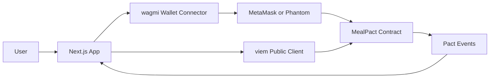

# LaterMe

> One meal. Two futures. One onchain promise.

LaterMe 是一个运行在 Monad 上的微承诺应用。用户在准备吃东西时选择一个现实可行的小行动，用钱包创建一份短期 Pact；Pact 完成、取消或到期后，锁定的测试 MON 会退回钱包。

当前仓库是可现场演示的黑客松 MVP：使用固定的安全提案和 **1 秒 Pact**，可以快速展示创建、到期、退款和链上历史记录的完整闭环。

## 当前功能

- 连接 MetaMask 或 Phantom EVM 钱包；
- 自动识别并切换至 Monad Testnet；
- 通过 `/api/negotiate` 生成两个选择（有 LLM key 时用 AI，否则安全 fallback）；
- 创建锁定 `0.001 MON` 的 1 秒 Meal Pact；
- 完成、取消或到期 Pact，并自动退款；
- 从 `PactCreated` 事件读取当前钱包的 Pact 列表；
- 查看 Pact 详情、链上状态、截止时间和交易记录；
- 每秒更新时间状态、定时刷新链上数据，无需反复刷新页面；
- 排除已知会争抢 `window.ethereum` 的 Gate Wallet provider。

## 演示流程

```text
输入当前想吃的食物
        ↓
选择 Current Me 或 Later Me
        ↓
连接钱包并创建 Pact（0.001 MON）
        ↓
等待 1 秒
        ↓
Expire and refund
        ↓
在 My pacts 中查看 Expired 记录
```

完整演示通常可以在 60–90 秒内完成。

## Monad 部署

| 项目 | 值 |
| --- | --- |
| Network | Monad Testnet |
| Chain ID | `10143` (`0x279f`) |
| Contract | [`0xC187dC6b75DA1255cF9bEb52d8e9585A7e483315`](https://testnet.monadexplorer.com/address/0xC187dC6b75DA1255cF9bEb52d8e9585A7e483315) |
| Deployment tx | [`0xe02ad08a10d348ae936253de16c42a8e807f299f3e23852931b0ba92d8324881`](https://testnet.monadexplorer.com/tx/0xe02ad08a10d348ae936253de16c42a8e807f299f3e23852931b0ba92d8324881) |
| Deployment block | `52095976` |
| HTTP RPC | `https://monad-testnet-rpc.huginn.tech` |
| WebSocket RPC | `wss://wss.monad-testnet-rpc.huginn.tech` |
| Explorer | [Monad Testnet Explorer](https://testnet.monadexplorer.com) |

部署元数据保存在 [`contracts/deployments/10143.json`](./contracts/deployments/10143.json)。

## 技术架构



### 技术栈

- **Frontend:** Next.js 16、React 19、TypeScript；
- **Web3:** wagmi 3、viem 2；
- **Contract:** Solidity `0.8.24`、Foundry；
- **Network:** Monad Testnet；
- **State:** TanStack Query + 链上事件与合约读取。

### 页面

| Route | 作用 |
| --- | --- |
| `/` | 产品首页与钱包连接 |
| `/negotiate` | 输入食物，经 `/api/negotiate` 生成两个选择 |
| `/pact/new` | 审阅并创建 Pact |
| `/pacts` | 当前钱包的 Pact 列表 |
| `/pacts/[id]` | Pact 详情与结算操作 |

## 本地运行

### 环境要求

- Node.js 20+；
- pnpm 9；
- Foundry（运行或部署合约时需要）；
- MetaMask 或 Phantom；
- Monad Testnet 测试 MON。

### 启动前端

```bash
pnpm install
cp apps/web/.env.example apps/web/.env.local
pnpm dev
```

打开 [http://localhost:3000](http://localhost:3000)。

默认环境配置：

```dotenv
NEXT_PUBLIC_MONAD_TESTNET_RPC_URL=https://monad-testnet-rpc.huginn.tech
NEXT_PUBLIC_MONAD_TESTNET_WS_URL=wss://wss.monad-testnet-rpc.huginn.tech
NEXT_PUBLIC_MEAL_PACT_ADDRESS=0xC187dC6b75DA1255cF9bEb52d8e9585A7e483315

# Optional AI negotiation (OpenAI-compatible). Omit to use safe fallback.
OPENAI_API_KEY=
OPENAI_BASE_URL=https://api.openai.com/v1
OPENAI_MODEL=gpt-4o-mini
```

### 钱包设置

1. 在 MetaMask 或 Phantom 中添加 Monad Testnet；
2. Chain ID 设置为 `10143`；
3. RPC 设置为 `https://monad-testnet-rpc.huginn.tech`；
4. 解锁钱包并打开 LaterMe；
5. 如果安装了 Gate Wallet，建议在 LaterMe 站点禁用它，避免多个扩展争抢 `window.ethereum`。

如果页面运行在不支持浏览器扩展的内置浏览器中，请改用安装了钱包的 Chrome profile 打开。

### 部署到 Vercel

这是 pnpm monorepo 里的 Next.js 应用，不是静态站点。在 Vercel Project Settings 中确认：

| 设置 | 值 |
| --- | --- |
| Framework Preset | `Next.js` |
| Root Directory | `apps/web` |
| Output Directory | **留空**（不要填 `public`） |
| Install / Build Command | 默认即可 |

并配置与 `.env.example` 相同的 `NEXT_PUBLIC_*` 环境变量。若要启用真实 AI 谈判，再配置服务端 `OPENAI_API_KEY`（以及可选的 `OPENAI_BASE_URL` / `OPENAI_MODEL`）。`apps/web/vercel.json` 会强制使用 Next.js framework。

## 验证项目

```bash
pnpm test:web
pnpm test:protocol
pnpm typecheck
pnpm lint
pnpm build
pnpm test:contracts
```

当前测试覆盖钱包网络判断、Pact 草稿迁移、谈判 API 的 fallback/拒答/重试、Moss `protocol-laterme` Capability 计划构建、事件区块分段、状态显示、钱包 provider 筛选，以及合约创建和退款安全路径。

## 智能合约

`MealPact.sol` 保存以下链上状态：

```solidity
struct Pact {
    address owner;
    uint64 deadline;
    uint96 amount;
    bytes32 proposalHash;
    bytes32 completionHash;
    Status status;
}
```

主要函数：

- `createPact(bytes32 proposalHash, uint64 durationSeconds)`；
- `completePact(uint256 pactId, bytes32 completionHash)`；
- `cancelPact(uint256 pactId)`；
- `expirePact(uint256 pactId)`；
- `getPact(uint256 pactId)`。

当前演示合约只接受 `1` 秒 duration。完成、取消和到期都会把 Pact 中的原生 MON 退回 owner；合约使用单次状态转换、权限检查和重入保护避免重复结算。

### Moss Protocol 包（P1）

[`packages/protocol-laterme`](./packages/protocol-laterme) 把 `MealPact` 暴露为 Moss Capabilities（基于已发布的 `@themoss/core@0.1.0`）：

- `createPact` / `completePact` / `cancelPact` / `expirePact` / `getPact`
- 返回未签名 Plan，附带 `expects` 与 `@Event` confirms
- 强制 `durationSeconds = 1`，锁定金额 `<= 0.01 MON`
- 当前地址指向 Monad Testnet 部署；接入时用 `createRuntime({ chainId: 10143, … })`

前端仍走 wagmi；P2 会做 Moss / viem 双路径。

### 合约测试

```bash
pnpm test:contracts
```

### 部署新合约

```bash
cp contracts/.env.example contracts/.env
cd contracts
set -a
source .env
set +a
forge script script/DeployMealPact.s.sol:DeployMealPact \
  --rpc-url monad_testnet \
  --broadcast
```

`contracts/.env` 只用于本地环境。不要提交私钥，也不要在客户端环境变量中保存私钥。

## 隐私与安全边界

- 饮食文本只保存在当前浏览器的 Pact 草稿中，不写入链上；
- 链上仅保存提案哈希、钱包、截止时间、金额和状态；
- LaterMe 不提供医疗诊断、药物建议或极端减重建议；
- 应用不能代替用户签名，所有写操作都必须由钱包确认；
- 当前使用测试 MON，不应向演示合约发送主网资产。

## 仓库结构

```text
.
├── apps/web/                      # Next.js 前端
├── contracts/                     # Foundry 合约、测试和部署脚本
├── packages/protocol-laterme/     # Moss Protocol：MealPact Capabilities
├── LATERME_MVP_PLAN.md            # 产品规划与长期设想
├── TECHNICAL_DESIGN.zh-CN.md      # 扩展架构设计
└── README.md
```

`LATERME_MVP_PLAN.md` 和 `TECHNICAL_DESIGN.zh-CN.md` 包含 AI、Moss、存储和 XP 等后续设想；这些能力不代表已经包含在当前可运行 MVP 中。

## 下一步

- 部署前端并配置公开演示地址；
- ~~加入真实 LLM negotiation API 与严格结构化输出校验~~（P0 已完成；无 key 时自动 fallback）；
- ~~Moss `@laterme/protocol-laterme` Capability 包~~（P1 已完成；P2 再接到前端双路径）；
- 增加交易级 E2E 测试和移动端钱包测试；
- 将 1 秒演示时长改为可配置的产品时长；
- 增加可选的私有完成证明和 XP 投影。

## License

本仓库尚未声明开源许可证。
