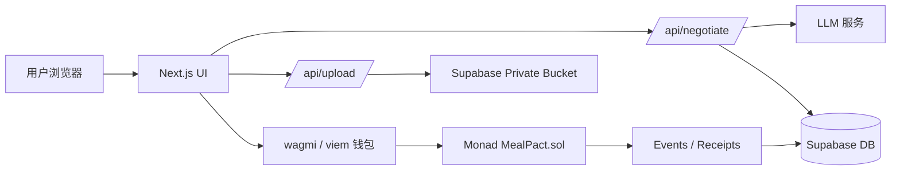
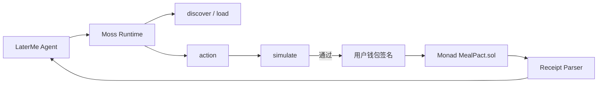

# LaterMe

> **Every bite is a conversation with LaterMe.**

LaterMe 是一个面向饮食决策时刻的 AI 微承诺应用。用户在点餐、准备吃夜宵或面对零食时，先与“未来的自己”进行一次简短谈判，再把自己的选择变成一个可执行、可验证、可重复的链上承诺。

Moss 是 LaterMe 的可选 Agent 执行层：它让 AI Agent 能够发现、模拟并安全构建 Monad 链上交易，但必须经过用户确认后才签名发送。

LaterMe 不提供医疗诊断、减重处方或卡路里预测。它解决的是更具体的问题：**用户知道什么选择更符合长期目标，却经常在当下的冲动中放弃。**

## 1. 黑客松项目价值

### 对用户的价值

- 在最容易冲动的饮食瞬间提供即时帮助，而不是事后记录和责备。
- AI 不替用户做决定，而是把当前选择和更符合长期目标的替代方案清晰呈现出来。
- 用户可以用一个 10–30 分钟的微承诺开始行动，降低“我要彻底改变生活”的心理门槛。
- 完成承诺后获得可验证的链上记录和应用内 XP，形成持续反馈。

### 对 Monad 的价值

LaterMe 把 Monad 从“部署智能合约的链”变成产品体验的一部分：

- 饭前几秒内创建 Pact，低延迟反馈让承诺不会打断用户当下的决策。
- 每个微承诺都可以低成本上链，适合高频、低金额的行为交互。
- 多个独立的饮食或健康微承诺可以并行创建和结算，为未来的 AI Agent 协同和大规模行为经济提供基础。
- EVM 兼容使现有 Solidity、viem、wagmi 工具链可以快速构建 MVP。

### 对 Moss 的价值

LaterMe 为 Moss 提供一个真实的 Agent Capability 场景。LaterMe Agent 可以通过 Moss：

- 发现 `create_pact`、`complete_pact`、`cancel_pact` 等链上能力；
- 在交易发送前模拟 Pact 的资金流和状态变化；
- 使用结构化 Receipt 验证 `PactCreated`、`PactCompleted` 等事件；
- 将最终签名权留给用户钱包，而不是交给 AI。

### 对黑客松评委的展示价值

60–90 秒内可以展示完整闭环：

```text
输入一顿想吃的东西
       ↓
AI 以“未来的我”身份提出两个选择
       ↓
用户选择并签署 Meal Pact
       ↓
Monad 上即时创建承诺
       ↓
完成行动并提交证明
       ↓
链上结算 + XP + 可分享结果
```

项目同时展示 AI、Consumer Crypto、健康行为、链上承诺和 Monad 的低延迟体验，但不依赖复杂的 Token 经济或医疗数据上链。

## 2. 背景

多数饮食和减重产品集中在以下环节：

- 记录已经吃完的食物；
- 计算卡路里、宏量营养素或体重趋势；
- 提供长期计划和提醒；
- 依靠用户意志力坚持。

但真正容易失败的时刻往往发生在更早之前：用户正准备点餐、打开外卖软件、拿起零食，只有几秒钟做决定。此时用户通常不需要一份复杂报告，而需要一个快速、尊重、具体的“下一步”。

LaterMe 将产品介入点前移到**饮食决策发生的瞬间**。

## 3. 我们要解决的问题

### 用户问题

1. 用户知道长期目标，但无法在即时诱惑中执行。
2. 普通健康 App 偏重记录和事后反馈，无法帮助用户完成当下决策。
3. 长期目标过于抽象，“减重”“变健康”难以转化为今天的一个动作。
4. 许多 AI 健康产品只是生成建议，用户没有真正的行动闭环。

### 产品问题

如果只是做一个 AI 饮食聊天机器人，用户可以得到建议，却没有理由执行；如果只是做一个链上打卡工具，链上记录又与用户当下的选择脱节。

LaterMe 需要把两者连接起来：

> **AI 负责帮助用户做出选择，Monad 负责让选择成为一个即时、可验证、可结算的承诺。**

## 4. 解决方案

LaterMe 的核心机制只有一句话：

> **一餐，两个未来，一个可兑现的承诺。**

用户输入当前想吃的东西后，AI 生成两个选项：

- **Current Me**：保留当前选择，但给出一个现实、尊重用户的执行方式；
- **Later Me**：提供一个更符合长期目标的轻量替代方案。

用户自主选择其中一个方案，并创建 10、15、20 或 30 分钟的 Meal Pact。Pact 可以包含喝水、短走、份量调整或 mindful pause 等安全行动。

用户完成后，通过钱包签署完成声明，可选择提交一张照片。照片默认只在浏览器本地计算 SHA-256，若用户明确同意才上传到私有存储，且 24 小时后自动删除。

完成、取消或到期都会退回测试 MON；完成 Pact 额外获得 XP。MVP 不惩罚失败，也不把健康数据公开或写入链上。

## 5. 目标用户

### MVP 用户

- 经常在外卖、夜宵、办公室零食等场景中做饮食选择的人；
- 希望建立更稳定饮食习惯，但不想使用复杂卡路里记录工具的人；
- 熟悉钱包或愿意通过观摩模式体验 Consumer Crypto 的用户；
- 对 AI Agent、链上身份和可验证行为记录感兴趣的早期用户。

### 不服务的人群

LaterMe 不面向需要临床营养指导、疾病管理、药物建议或极端减重方案的人群。涉及医疗或危险行为的输入会被安全拒绝并引导用户寻求专业帮助。

## 6. 用户流程

1. 用户进入首页，连接钱包，切换到 Monad Testnet；也可以先使用观摩模式。
2. 用户输入“我现在想吃炸鸡和奶茶”，或选择预设餐食。
3. LaterMe AI 以未来自我的语气生成两个尊重、具体的选择。
4. 用户选择 Current Me 或 Later Me，并确认 10–30 分钟行动。
5. 钱包签署 `createPact`，Monad 返回交易回执，页面即时显示 Active。
6. 用户完成行动，可选择拍照生成本地证明哈希。
7. 用户签署 `completePact`，合约退回测试 MON。
8. 前端读取链上事件，Supabase 幂等写入 XP，展示交易哈希、完成状态和分享卡片。

## 7. 技术架构



### Moss Agent 执行层



MVP 主流程仍使用 `wagmi + viem` 保证三天交付；Moss 作为 Agent Demo 和安全执行层接入。Moss 当前主要面向 Monad 主网，因此 Testnet 需要额外完成 chain 配置和 `protocol-laterme` 适配后才能作为唯一交易路径。

### 前端

- Next.js + TypeScript；
- wagmi + viem 连接钱包、切换 Monad Testnet、发送交易和读取回执；
- 页面：`/`、`/negotiate`、`/pact/:id`、`/pact/:id/result`；
- 明确的交易状态机：`NEGOTIATING → PROPOSAL_READY → TX_PENDING → ACTIVE → COMPLETING → COMPLETED`；
- 刷新后通过 `pactId` 和 `txHash` 恢复状态。

### 后端

- Next.js API Routes；
- `/api/negotiate`：调用 LLM，校验严格 JSON Schema，处理超时、429、恶意输入和安全拒答；
- `/api/upload`：处理用户明确同意后的私有照片上传；
- 固定安全 fallback，确保 LLM 不可用时仍能完成 Demo。

### 智能合约

合约名称：`MealPact.sol`

核心数据：

```solidity
struct Pact {
    address owner;
    uint64 deadline;
    uint96 amount;
    bytes32 proposalHash;
    bytes32 completionHash;
    Status status;
}
```

核心函数：

- `createPact(bytes32 proposalHash, uint64 duration)`；
- `completePact(uint256 pactId, bytes32 completionHash)`；
- `cancelPact(uint256 pactId)`；
- `expirePact(uint256 pactId)`。

合约只接受原生 MON，duration 仅允许 10/15/20/30 分钟。合约是资金和 Pact 状态的唯一事实来源；AI 原始文本、照片和健康内容不上链。

安全要求包括：checks-effects-interactions、`nonReentrant`、单次结算、权限校验、截止时间校验和退款失败处理。

### 数据库与存储

Supabase 仅作为链上状态的投影和应用数据层：

- `pacts_projection`：Pact ID、owner、交易哈希、提案和状态投影；
- `completion_artifacts`：完成哈希、私有 storage key、过期时间；
- `xp_ledger`：钱包、Pact、事件交易哈希和 XP，使用唯一约束保证幂等。

原始照片不公开，默认 24 小时 TTL；用户未同意时不上传。

### AI 工作流

AI 只负责生成建议，不负责直接写入合约参数或替用户做决定。

1. 校验用户输入长度和格式；
2. 将输入作为不可信内容传入系统 Prompt；
3. 要求输出严格 `PactProposal` JSON；
4. 使用 Zod/JSON Schema、时长白名单和行动类型白名单校验；
5. 对医疗、极端节食、催吐、药物和危险运动请求拒绝；
6. 超时、429 或格式错误时返回固定安全模板。

当启用 Moss 时，AI 只能生成并模拟未签名交易，不能直接签名或发送。用户确认以下内容后，钱包才会接触交易：Pact 时长、锁定金额、行动文本、目标合约和预期 Receipt。

## 8. 业务模式与创业潜力

### 长期产品方向

LaterMe 的长期目标不是成为另一个卡路里记录器，而是成为一个**个人未来自我承诺协议**：每次用户面对诱惑时，AI 帮助生成一个私密、可验证、可组合的行为承诺，并根据历史完成率逐渐调整挑战强度。

未来可以扩展到：

- 健身、睡眠、学习和消费冲动等其他即时决策；
- 多个 AI Agent 协同管理不同类型的个人承诺；
- 钱包、雇主健康福利、健身房和营养服务集成；
- 用户授权后的隐私保护型习惯证明；
- 面向应用开发者的 Commitment API 和 Monad 原生结算层。

### 商业模式

- Freemium：基础每日 Pact 免费，高级 AI 记忆和个性化策略订阅；
- B2B：向健身房、健康教练和企业 wellness 提供品牌化承诺系统；
- API：向 Consumer Crypto 和 AI Agent 应用提供低成本微承诺结算能力；
- 合作分成：与健康服务、餐饮和运动产品进行授权合作。

MVP 不发行可交易 Token，不把用户健康数据出售给第三方，也不依赖惩罚用户来产生收入。

## 9. MVP 范围

### 必须完成

- 文字或预设餐食输入；
- 一次 LLM 谈判和严格 JSON 校验；
- 两个用户可理解的选择；
- Monad Testnet 上创建、完成、取消和到期 Pact；
- 钱包切链、Faucet 引导和观摩模式；
- 可选照片哈希和私有短期存储；
- XP 幂等记录；
- 20 个 AI Eval fixture 和一条 E2E 主流程。

### 明确不做

- 医疗建议、疾病判断、卡路里或体重预测；
- 视觉食物识别、穿戴设备和健康数据接入；
- ZK、Oracle、Relayer、ERC-20 XP 和惩罚池；
- 公开照片、永久健康数据和多人社交 Feed。

## 10. 三天开发计划

### Day 1：链上基础与核心页面

- 初始化 Foundry 和 Monad Testnet；
- 完成 `MealPact.sol`、事件、退款和合约测试；
- 初始化 Next.js、wagmi、viem；
- 完成首页、输入页、Pact 页面和钱包切链。

### Day 2：AI 与链上闭环

- 完成 `/api/negotiate`、Prompt、Schema 和安全 fallback；
- 接入提案选择和 `createPact`；
- 完成回执状态机、Supabase 投影和 XP ledger；
- 加入 20 个 AI Eval fixture。

### Day 3：证明、容错与 Demo

- 完成本地照片哈希、EXIF 清理和可选私有上传；
- 接入 `completePact`、取消、到期和刷新恢复；
- 完成 E2E、钱包失败路径、观摩模式和分享卡片；
- 部署、录制 75 秒 Demo、准备 Pitch Deck。

## 11. 成功标准

黑客松 MVP 达成以下结果即可视为成功：

- 新用户无需解释即可理解“一餐、两个未来、一个 Pact”；
- 从输入餐食到 Monad 上创建 Pact 不超过一分钟；
- LLM 失败时 Demo 仍可继续；
- 完成证明、退款和 XP 都能被验证；
- 评委能明确看到 Monad 的低延迟、低成本和可扩展微承诺价值；
- 产品不会把健康建议伪装成医疗结论，也不会公开敏感数据。

## 12. 项目文件

- [LATERME_MVP_PLAN.md](./LATERME_MVP_PLAN.md)：完整产品、合约、数据流、测试和开发计划。
- [TECHNICAL_DESIGN.zh-CN.md](./TECHNICAL_DESIGN.zh-CN.md)：Moss、Agent、合约、数据流和接口的详细技术方案。
